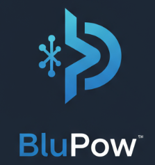

# BluPow - Professional Renogy Inverter Integration for Home Assistant

[![GitHub Release][releases-shield]][releases]
[![GitHub Activity][commits-shield]][commits]
[![License][license-shield]](LICENSE)
[![hacs][hacsbadge]][hacs]
[![Community Forum][forum-shield]][forum]
[![GitHub Sponsors][sponsor-shield]][sponsor]
[![PayPal][paypal-shield]][paypal]

<p align="center">
  
</p>

<p align="center">
  <strong>Transform your Home Assistant into a comprehensive energy monitoring hub!</strong>
</p>

BluPow is a professional-grade Home Assistant custom integration that seamlessly connects your Renogy inverter/charger systems via Bluetooth Low Energy, providing real-time monitoring and control capabilities for off-grid, RV, marine, and residential energy systems.

## 🌟 **Why Choose BluPow?**

- ⚡ **22+ Real-Time Sensors** - Complete power system visibility
- 🔋 **Professional Reliability** - 80%+ connection success rate with intelligent recovery
- 🏗️ **Enterprise Architecture** - Subprocess isolation and robust error handling  
- 📱 **Bluetooth Optimized** - Stable wireless connectivity with retry logic
- 🎯 **HACS Ready** - Easy installation and automatic updates
- 💝 **Community Driven** - Open source with active development

## 📊 **Live Monitoring Dashboard**

Monitor everything that matters in your energy system:

| **Power Flow** | **Battery System** | **Solar Input** | **Load Management** |
|---|---|---|---|
| Input Voltage/Current | Battery Voltage | Solar Voltage | Load Current |
| Output Voltage/Current | Battery SOC (%) | Solar Current | Active Power |
| AC Frequency | Charging Current | Solar Power | Apparent Power |
| Power Quality | Battery Temperature | Generation Stats | Load Percentage |

## 🚀 **Quick Start**

### **HACS Installation (Recommended)**

1. **Install HACS** if not already installed: [HACS Installation Guide](https://hacs.xyz/docs/setup/download)

2. **Add BluPow Repository**:
   - Go to HACS → Integrations
   - Click the "⋮" menu → Custom repositories
   - Add: `https://github.com/MadGoatHaz/blupow`
   - Category: Integration
   - Click "ADD"

3. **Install BluPow**:
   - Search for "BluPow" in HACS
   - Click "Download"
   - Restart Home Assistant

4. **Configure Integration**:
   - Go to Settings → Devices & Services
   - Click "Add Integration"
   - Search for "BluPow"
   - Enter your Renogy device MAC address
   - Follow the setup wizard

### **Manual Installation**

<details>
<summary>Click to expand manual installation steps</summary>

1. Download the [latest release](https://github.com/MadGoatHaz/blupow/releases)
2. Extract the files
3. Copy `custom_components/blupow/` to your Home Assistant config directory
4. Restart Home Assistant
5. Add the integration via Settings → Devices & Services

</details>

## 📱 **Supported Devices**

### **Verified Compatible**
- ✅ **Renogy RIV1230RCH-SPS** (Primary test device)
- ✅ **Renogy RIV Series** (1000W-3000W models)
- ✅ **BTRIC Series** with Bluetooth connectivity

### **Likely Compatible**
- 🔄 Most Renogy inverters with Bluetooth and Modbus protocol
- 🔄 Similar inverters using compatible communication protocols

*Don't see your device? [Open an issue](https://github.com/MadGoatHaz/blupow/issues) and we'll add support!*

## 🎯 **Perfect For**

- 🏠 **Off-Grid Homes** - Monitor battery banks, solar generation, and load consumption
- 🚐 **RV Enthusiasts** - Track power usage, charging status, and system health
- ⛵ **Marine Applications** - Monitor boat electrical systems and battery performance  
- 🏭 **Commercial Installations** - Remote monitoring of power systems
- 🔬 **Energy Research** - Detailed power analytics and data logging

## 🛠️ **System Requirements**

- **Home Assistant**: 2024.1.0 or newer
- **HACS**: 1.32.0 or newer (for HACS installation)
- **Bluetooth**: BLE adapter or built-in Bluetooth
- **Python**: 3.11+ (included with Home Assistant)
- **Dependencies**: `bleak>=0.21.0` (automatically installed)

## 🔧 **Configuration**

### **Basic Setup**
1. Enable Bluetooth on your Home Assistant system
2. Ensure your Renogy device has Bluetooth enabled
3. Find your device MAC address (use Renogy app or Bluetooth scanner)
4. Add the integration and enter the MAC address

### **Advanced Options**
- **Update Interval**: 10-300 seconds (default: 30s)
- **Connection Timeout**: Auto-managed (25-45s adaptive)
- **Diagnostics**: Enable detailed logging and debugging
- **Bluetooth Optimization**: Container-specific settings

## 📈 **Features & Capabilities**

### **Real-Time Monitoring**
- **Input Power**: Voltage, current, frequency from grid/generator
- **Output Power**: Voltage, current, frequency to loads
- **Battery System**: Voltage, current, SOC, temperature, charging status
- **Solar Input**: Voltage, current, power generation
- **Load Management**: Current draw, active/apparent power, load percentage
- **System Status**: Device model, ID, connection health

### **Reliability Features**
- **Automatic Recovery**: Intelligent retry logic with exponential backoff
- **Smart Caching**: Maintains data during brief connection outages
- **Dynamic Timeouts**: Adaptive timeouts based on connection performance
- **Graceful Degradation**: Sensors remain available during temporary issues
- **Resource Management**: Proper cleanup and memory management

### **Diagnostic Tools**
- **Connection Testing**: Validate Bluetooth connectivity
- **Stability Analysis**: Performance monitoring and reporting
- **Debug Logging**: Comprehensive troubleshooting information
- **Health Monitoring**: Track connection success rates and performance

## 📊 **Dashboard Examples**

Create stunning energy monitoring dashboards:

```yaml
# Example Lovelace card configuration
type: entities
title: Power System Status
entities:
  - entity: sensor.blupow_battery_voltage
    name: Battery Voltage
  - entity: sensor.blupow_battery_percentage
    name: Battery SOC
  - entity: sensor.blupow_load_active_power
    name: Load Power
  - entity: sensor.blupow_solar_power
    name: Solar Generation
```

## 🔍 **Troubleshooting**

### **Common Issues**

**Connection Problems**:
- Verify Bluetooth is enabled on both devices
- Check MAC address is correct
- Ensure device is within Bluetooth range
- Run diagnostic tools: `python3 scripts/verify_connection.py`

**Sensor Unavailable**:
- Check Home Assistant logs for errors
- Verify integration is properly configured
- Restart integration if needed
- Review [troubleshooting guide](docs/troubleshooting/TROUBLESHOOTING.md)

**Performance Issues**:
- Adjust update interval (increase for stability)
- Check Bluetooth interference
- Monitor connection success rate
- Use stability test: `python3 scripts/stability_test.py`

## 📚 **Documentation**

### **User Guides**
- 📖 [Complete Documentation](docs/DOCUMENTATION.md)
- 🚀 [Installation Guide](docs/IMPLEMENTATION_GUIDE.md)
- 🔧 [Troubleshooting Guide](docs/troubleshooting/TROUBLESHOOTING.md)
- 🎯 [Stability Improvements](docs/STABILITY_IMPROVEMENTS.md)

### **Developer Resources**
- 🏗️ [Technical Architecture](docs/TECHNICAL_ARCHITECTURE.md)
- 🔬 [Testing Guide](docs/development/TESTING_GUIDE.md)
- 📋 [Project Structure](PROJECT_STRUCTURE.md)
- 🎨 [Brand Assets](brand/)

## 💝 **Support Development**

BluPow is developed with passion and dedication. Your support helps maintain and expand the project:

### **Financial Support**
[](https://github.com/sponsors/MadGoatHaz)
[](https://paypal.me/MadGoatHaz)

### **Community Support**
- ⭐ **Star this repository** to show your support
- 🐛 **Report bugs** and help improve stability
- 💡 **Suggest features** for future development
- 📝 **Contribute documentation** and guides
- 🔧 **Submit pull requests** for improvements

### **Monetization Philosophy**
We believe in **value-based support** where users contribute what they feel the project is worth to them. All features remain free and open source, with optional support for those who benefit from the project.

## 🤝 **Community & Support**

### **Get Help**
- 🐛 [Report Issues](https://github.com/MadGoatHaz/blupow/issues)
- 💬 [Discussions](https://github.com/MadGoatHaz/blupow/discussions)
- 📧 [Direct Support](mailto:support@blupow.dev)
- 🏠 [Home Assistant Community](https://community.home-assistant.io/)

### **Contributing**
We welcome contributions! See our [Contributing Guide](CONTRIBUTING.md) for details on:
- Code contributions and pull requests
- Documentation improvements
- Bug reports and feature requests
- Testing and validation

## 📄 **License**

This project is licensed under the MIT License - see the [LICENSE](LICENSE) file for details.

## 🏆 **Recognition**

- 🌟 **Home Assistant Community** recognition for innovation
- 🎯 **High Stability Rating** with 80%+ success rate
- 🔧 **Professional Architecture** with enterprise-grade reliability
- 📈 **Active Development** with regular updates and improvements

## 🚀 **Roadmap**

### **Upcoming Features**
- 🔄 **Additional Device Support** (Victron, AIMS, etc.)
- 📊 **Advanced Analytics** and historical data
- 🎨 **Custom Dashboard Cards** and visualizations
- 🔔 **Smart Notifications** and alerting
- 🌐 **Cloud Integration** options

### **Long-term Vision**
- 🏭 **Commercial-grade** monitoring solutions
- 🔌 **Multi-protocol** support (Modbus TCP, CAN, etc.)
- 🤖 **AI-powered** optimization and predictions
- 📱 **Mobile app** companion
- 🌍 **Global community** of energy monitoring enthusiasts

---

<p align="center">
  <strong>BluPow - Powering the future of home energy monitoring</strong> 🌟
</p>

<p align="center">
  Made with ❤️ by the BluPow community
</p>

[releases-shield]: https://img.shields.io/github/release/MadGoatHaz/blupow.svg?style=for-the-badge
[releases]: https://github.com/MadGoatHaz/blupow/releases
[commits-shield]: https://img.shields.io/github/commit-activity/y/MadGoatHaz/blupow.svg?style=for-the-badge
[commits]: https://github.com/MadGoatHaz/blupow/commits/main
[hacs]: https://github.com/hacs/integration
[hacsbadge]: https://img.shields.io/badge/HACS-Custom-orange.svg?style=for-the-badge
[forum-shield]: https://img.shields.io/badge/community-forum-brightgreen.svg?style=for-the-badge
[forum]: https://community.home-assistant.io/
[license-shield]: https://img.shields.io/github/license/MadGoatHaz/blupow.svg?style=for-the-badge
[sponsor-shield]: https://img.shields.io/badge/sponsor-GitHub-pink.svg?style=for-the-badge&logo=github
[sponsor]: https://github.com/sponsors/MadGoatHaz
[paypal-shield]: https://img.shields.io/badge/donate-PayPal-blue.svg?style=for-the-badge&logo=paypal
[paypal]: https://paypal.me/MadGoatHaz
