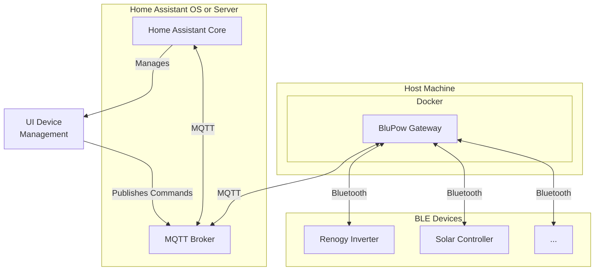

# BluPow - A Universal Bluetooth Device Integration for Home Assistant

[![GitHub Release][releases-shield]][releases]
[![GitHub Activity][commits-shield]][commits]
[![License][license-shield]](LICENSE)

[![Project Maintenance][maintenance-shield]][maintenance-url]
[![GitHub Sponsors][sponsors-shield]][sponsors]

**A professional, stable, and extensible gateway to bring your Bluetooth Low Energy (BLE) devices into Home Assistant.**

## 🎯 **Project Goals**

This project provides a rock-solid bridge between the world of Bluetooth Low Energy (BLE) devices and your Home Assistant instance. It is built on three core principles:

1.  **Stability**: All Bluetooth communication is handled by a standalone gateway, completely decoupled from the Home Assistant process. Bluetooth instability will *never* crash your smart home.
2.  **Extensibility**: The driver-based architecture is designed for easy expansion. Adding support for new BLE devices is straightforward and doesn't require changing the core gateway logic.
3.  **Usability**: The entire experience, from initial device discovery to adding and removing devices, is managed through a clean, simple Home Assistant UI.

---

## ✨ **Features: Current & Future**

| Status | Feature | Description |
| :--- | :--- | :--- |
| ✅ **Working** | **Decoupled Gateway Architecture** | A standalone Docker container handles all BLE communication, ensuring HA stability. |
| ✅ **Working** | **MQTT Communication** | Uses the industry-standard MQTT protocol for robust and reliable data transfer. |
| ✅ **Working** | **Home Assistant Discovery** | Automatically discovers and configures new devices and their sensors in HA. |
| ✅ **Working** | **UI-Driven Device Management** | Add, remove, and list your devices directly from the Home Assistant interface. |
| ✅ **Working** | **Renogy Device Support** | Out-of-the-box support for popular Renogy Inverters and Solar Controllers. |
| ✅ **Working** | **Generic Modbus Support** | A configurable driver allows for adding any Modbus-over-BLE device without new code. |
| 🔜 **Planned** | **Dynamic Driver Loading** | Add support for new devices by simply dropping a new driver file into a directory, no code changes needed. |
| 🔜 **Planned** | **Bluetooth Proxy Integration** | Utilize Home Assistant's Bluetooth proxy capabilities to extend range and eliminate the need for a dedicated BLE adapter on the gateway host. |
| 🔜 **Planned** | **Advertisement-based Sensors** | Add support for simple, connectionless BLE sensors (e.g., temperature/humidity) that broadcast their state. |

---

## 🏗️ **Architectural Overview**

This integration uses a modern, decoupled architecture to ensure stability and performance. It consists of two main parts:

1.  **The BluPow Gateway (`blupow_gateway`)**: A Python application, designed to be run as a Docker container. It connects directly to your Bluetooth devices, polls them for data, and publishes the data to an MQTT broker.
2.  **The Home Assistant Integration (`custom_components/blupow`)**: A lightweight component whose only job is to provide the UI for device management. It relies entirely on MQTT for communication and discovery.

This separation means that potentially unstable Bluetooth communication is handled outside of Home Assistant, preventing integration crashes from impacting your core smart home system.

---

## 🚀 **Installation & Setup**

Setup requires a running MQTT broker and Docker. For the most straightforward setup, follow the **[Quick Start Guide](docs/QUICK_START.md)**.

---

## 🤝 **Contributing & Support**

This project thrives on community contributions. Whether it's adding a new device driver, improving the documentation, or reporting a bug, your help is welcome.

- **[Contributing Guide](docs/CONTRIBUTING.md)** - Guidelines for development, and how to add support for a new device.
- **[GitHub Issues](https://github.com/MadGoatHaz/blupow/issues)** - Bug reports and feature requests.
- **[GitHub Discussions](https://github.com/MadGoatHaz/blupow/discussions)** - Community support and questions.

---

## 📜 **License**

This project is licensed under the **GNU General Public License v3.0**. Please see the [LICENSE](LICENSE) file for full details.

---

## ❤️ **Support The Project**

If this integration is useful to you, please consider showing your support! Ongoing development requires time and resources.

- **[GitHub Sponsors](https://github.com/sponsors/MadGoatHaz)** - The best way to support ongoing development with a monthly contribution.

**Maintainer**: [@MadGoatHaz](https://github.com/MadGoatHaz)

---

## Troubleshooting

-   **Sensors are "Unknown"**:
    *   Check the gateway logs: `docker logs blupow-gateway-1`. Look for Bluetooth connection errors or other issues.
    *   Use an MQTT exploration tool (like MQTT Explorer) to connect to your broker. Verify that topics under `homeassistant/sensor/blupow_...` are being created and that `blupow/.../state` topics are receiving data.
-   **Device not found during discovery?** Ensure your device is powered on, advertising, and within Bluetooth range of the machine running the gateway. The discovery scan is not overly filtered and should find any standard BLE device with a broadcast name.

---

<!-- Badges -->
[releases-shield]: https://img.shields.io/github/release/MadGoatHaz/blupow.svg?style=for-the-badge
[releases]: https://github.com/MadGoatHaz/blupow/releases
[commits-shield]: https://img.shields.io/github/commit-activity/y/MadGoatHaz/blupow.svg?style=for-the-badge
[commits]: https://github.com/MadGoatHaz/blupow/commits/main
[license-shield]: https://img.shields.io/badge/License-GPLv3-blue.svg?style=for-the-badge
[maintenance-shield]: https://img.shields.io/badge/maintainer-@MadGoatHaz-blue.svg?style=for-the-badge
[maintenance-url]: https://github.com/MadGoatHaz
[sponsors-shield]: https://img.shields.io/badge/GitHub-Sponsors-ff69b4.svg?style=for-the-badge
[sponsors]: https://github.com/sponsors/MadGoatHaz 