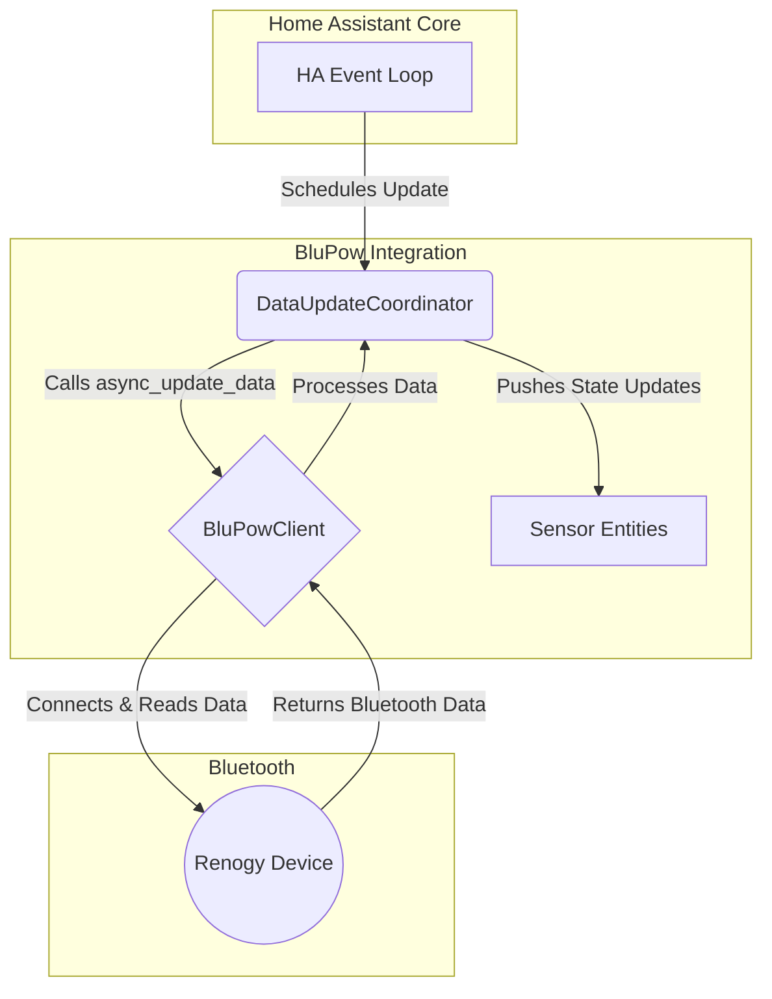

# BluPow Architecture

This document provides a high-level overview of the BluPow integration's architecture.

## Core Components

The integration is built around several key components that work together to fetch data from the Renogy device and present it in Home Assistant.

### 1. **DataUpdateCoordinator (`coordinator.py`)**

-   This is the heart of the integration, responsible for managing the data polling schedule.
-   It uses the `BluPowClient` to fetch new data from the device at regular intervals (e.g., every 30 seconds).
-   It holds the latest data and pushes updates to all registered sensor entities when new data is available.

### 2. **BluPowClient (`blupow_client.py`)**

-   This class is responsible for all direct communication with the Bluetooth device.
-   It uses the `bleak` library, via Home Assistant's Bluetooth backend, to connect, read characteristics, and disconnect.
-   It contains the logic to parse the raw byte data received from the device into a structured format.

### 3. **Sensor Entities (`sensor.py`)**

-   These are the actual `SensorEntity` objects that appear in Home Assistant.
-   Each sensor (e.g., Battery Voltage, Solar Power) is linked to the `DataUpdateCoordinator`.
-   They don't fetch data themselves; they simply read the latest state from the coordinator whenever an update is pushed.

### 4. **Config Flow (`config_flow.py`)**

-   This manages the user setup process through the Home Assistant UI.
-   It handles discovery of BluPow devices and creating the configuration entry for the integration.

## Data Flow

1.  Home Assistant starts the BluPow integration.
2.  The `async_setup_entry` function creates a `DataUpdateCoordinator` and a `BluPowClient`.
3.  The coordinator schedules its first data update.
4.  The coordinator calls the `BluPowClient` to connect to the Renogy device.
5.  The client connects, reads the necessary GATT characteristics, and parses the data.
6.  The data is returned to the coordinator.
7.  The coordinator notifies all its subscribers (the sensor entities) that new data is available.
8.  Each sensor updates its state in Home Assistant, which is then visible in the UI.
9.  This process repeats every 30 seconds. 