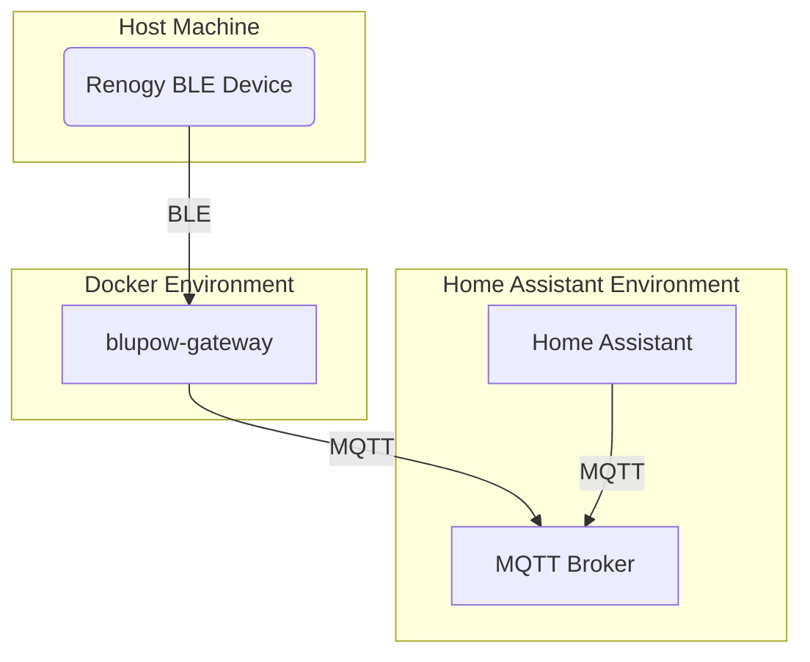

# BluPow Technical Architecture

This document outlines the technical architecture of the BluPow Home Assistant integration ecosystem. The architecture is designed for stability, reliability, and ease of use, leveraging containerization and a decoupled message-passing system.

## Core Components

The BluPow system is composed of three main components that work together to bring device data into Home Assistant.

### 1. BluPow Gateway (`blupow-gateway`)

*   **Description**: A standalone Docker container responsible for all communication with Bluetooth Low Energy (BLE) devices. It acts as a bridge, polling devices for data and publishing it to an MQTT broker.
*   **Technology**: Python, using the `bleak` library for BLE communication and `paho-mqtt` for MQTT communication.
*   **Key Features**:
    *   **Concurrent Polling**: The gateway uses a thread pool to poll multiple devices concurrently, improving performance and responsiveness.
    *   **Dynamic Device Management**: Devices are added and removed dynamically via MQTT commands, without requiring a gateway restart.
    *   **MQTT Command & Control**: The gateway listens on the `blupow/gateway/command` topic for JSON-formatted commands (e.g., `{"command": "add_device", "mac_address": "...", "type": "..."}`).
    *   **Resilience**: Runs as an independent, restartable service managed by Docker.

### 2. MQTT Broker (User-Provided)

*   **Description**: A standard MQTT broker is the central message bus for the BluPow ecosystem. This is a prerequisite and is **not** provided by the integration.
*   **Technology**: Any standard MQTT broker, such as the official `eclipse-mosquitto` Home Assistant addon.
*   **Key Features**:
    *   **Decoupling**: The broker completely decouples the BluPow Gateway from Home Assistant. If the gateway crashes, HA continues to run unaffected.
    *   **Standard Protocol**: Uses the industry-standard MQTT protocol for all communication.
    *   **Flexibility**: Users can leverage their existing MQTT infrastructure.

### 3. Home Assistant Custom Component (`custom_components/blupow`)

*   **Description**: The integration that runs inside Home Assistant. It provides the user interface for device management and relies on MQTT for all communication.
*   **Technology**: Home Assistant Integration Platform.
*   **Key Features**:
    *   **MQTT Discovery**: Uses Home Assistant's native MQTT Discovery mechanism. The gateway publishes configuration payloads that allow Home Assistant to automatically create sensor entities.
    *   **UI-Driven Device Management**: The integration features a "Configure" button that opens a UI to add new devices. This UI sends the `add_device` command directly to the gateway via MQTT.
    *   **Lightweight**: Contains no direct device communication logic (BLE, Modbus, etc.), making it stable and lightweight.

## Data Flow & Networking

The standard data flow is as follows:

1.  **Prerequisites**: The user has a working MQTT broker and a Docker environment with Bluetooth capabilities.
2.  **Installation**: The user runs the `blupow-gateway` using Docker Compose and installs the `blupow` custom component into Home Assistant.
3.  **Configuration**: The user adds the BluPow integration via the HA UI. It is added without requiring any initial configuration.
4.  **Add Device**: The user clicks "Configure" on the BluPow integration card in HA. They enter the MAC address and select the type for their new device.
5.  **Command**: The Home Assistant integration publishes an `add_device` command as a JSON payload to the `blupow/gateway/command` MQTT topic.
6.  **Polling & Publishing**: The `blupow-gateway` receives the command and adds the new device to its concurrent polling loop. Upon successful connection and data retrieval, it publishes two types of messages to the MQTT broker:
    *   **Discovery Payload**: A message to a topic like `homeassistant/sensor/blupow_D8B673BF4F75_battery_voltage/config`. This tells HA how to create the sensor.
    *   **State Payload**: A message to `blupow/D8B673BF4F75/state` containing the actual sensor data (e.g., `{"battery_voltage": 12.5}`).
7.  **Display**: Home Assistant's MQTT integration automatically discovers the new device and its sensors, and they appear in the UI.

## Extensibility: The Driver-Based Model

The gateway is designed to be easily extensible to support new devices without changing the core gateway code. This is achieved through a **Driver-Based Model**.

*   **Location**: Drivers are Python classes located in the `blupow_gateway/app/devices/` directory.
*   **Structure**: Each driver (e.g., `renogy_inverter.py`) defines a class that inherits from the abstract `BaseDevice` class. This ensures all drivers expose a consistent interface.
*   **Function**: The driver contains all the device-specific logic:
    *   The specific BLE characteristics to use for communication.
    *   The logic for building and parsing Modbus (or other protocol) commands.
    *   A complete definition of all sensors the device exposes, including names, units, and Home Assistant device classes.
*   **Dynamic Loading**: At startup, the gateway automatically scans the `devices` directory and loads any valid driver it finds. The `type` name used in the configuration (e.g., `renogy_inverter`) is automatically derived from the driver's class name (`RenogyInverter`).

This approach makes adding a new, unique device as simple as creating a new driver file that implements the `BaseDevice` contract.

### The `GenericModbusDevice` Driver: Codeless Integration

To further enhance extensibility, the gateway includes the `generic_modbus_device.py` driver. This special driver allows users to integrate a vast range of new devices **without writing any Python code**.

*   **Configuration-Driven**: By setting a device's `type` to `generic_modbus` in the configuration, a user can provide a `config` block that defines the device's entire protocol.
*   **Capabilities**: The user can specify the Modbus device ID, BLE UUIDs, and a complete list of sensors, including their registers, data types, and scaling factors.
*   **Reference**: For detailed instructions, see the **[Custom Device Configuration Guide](guides/CUSTOM_DEVICE_GUIDE.md)**.

## Future Vision

With the core architecture for UI-driven device management now in place, the future vision focuses on refining the user experience and expanding device support.

*   **Real-time UI Feedback**: Enhance the configuration UI to provide immediate feedback on whether a device was added successfully by listening for a confirmation from the gateway.
*   **Device Diagnostics**: Add a diagnostics section to the integration to expose gateway status, connected device states, and polling statistics to help users troubleshoot issues.
*   **Broader Device Support**: Continue adding new, dedicated drivers for popular devices to make the integration process even simpler for users.
*   **Energy Dashboard Integration**: Provide clear documentation and, if necessary, entity customizations to ensure seamless integration with Home Assistant's Energy Dashboard.
