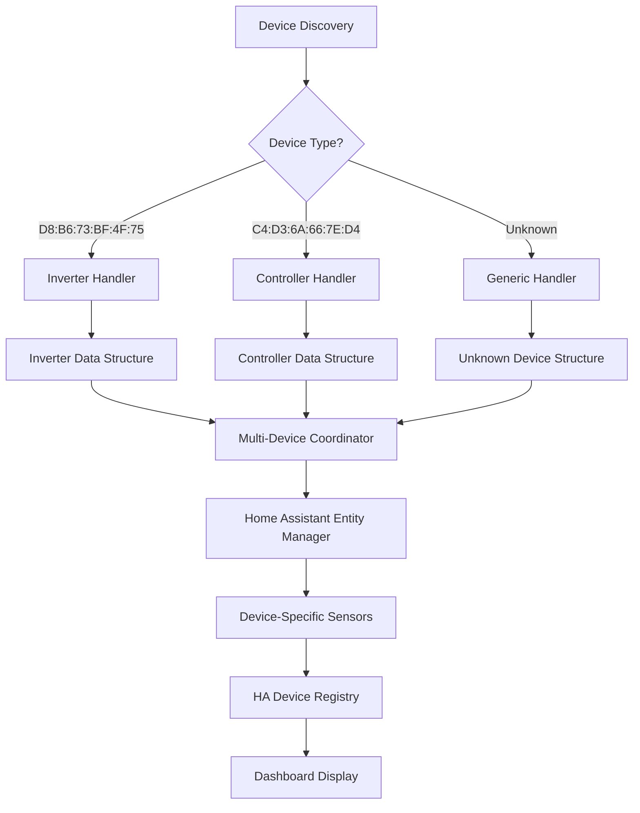

# BluPow Multi-Device Technical Architecture

## System Overview

BluPow is a Home Assistant integration designed to manage multiple Renogy device types simultaneously, each with distinct communication protocols, data structures, and operational characteristics. The architecture is built around device type identification and capability-based data handling.

## Architecture Principles

### 1. Device Type Segregation
- **Strict Type Isolation**: Each device type (Inverter, Controller, Battery) has completely separate data structures
- **Capability-Based Access**: Devices only expose sensors they actually support
- **No Cross-Contamination**: Inverter data never mixes with controller data

### 2. MAC Address-Based Identification
- **Primary Key**: MAC address serves as the unique device identifier
- **Type Mapping**: MAC addresses map to specific device types and models
- **Immutable Association**: Device type association never changes once established

### 3. Protocol Compliance
- **Renogy BT Standards**: Follows [Renogy BT Library](https://github.com/cyrils/renogy-bt) specifications
- **Device ID Mapping**: Uses standard Renogy device ID conventions
- **Communication Patterns**: Respects device-specific communication requirements

## Device Type Architecture

### INVERTER DEVICES (Type: RIV1230RCH-SPS)

#### Device Characteristics
```python
INVERTER_SPEC = {
    "device_type": "INVERTER",
    "model": "RIV1230RCH-SPS",
    "device_id": 32,  # Standard Renogy inverter ID
    "mac_pattern": "D8:B6:73:BF:4F:75",  # Known working device
    "primary_function": "AC_POWER_CONVERSION",
    "capabilities": [
        "AC_INPUT_MONITORING",
        "AC_OUTPUT_MONITORING", 
        "BATTERY_MANAGEMENT",
        "LOAD_MONITORING",
        "TEMPERATURE_MONITORING"
    ],
    "excluded_capabilities": [
        "SOLAR_MPPT",
        "GENERATION_STATISTICS",
        "DETAILED_SOLAR_MONITORING"
    ]
}
```

#### Data Structure Contract
```python
INVERTER_DATA_CONTRACT = {
    # AC Input Monitoring (Primary Function)
    "input_voltage": {"type": "float", "unit": "V", "range": [100, 140]},
    "input_current": {"type": "float", "unit": "A", "range": [0, 20]},
    "input_frequency": {"type": "float", "unit": "Hz", "range": [59, 61]},
    
    # AC Output Monitoring (Primary Function)
    "output_voltage": {"type": "float", "unit": "V", "range": [100, 140]},
    "output_current": {"type": "float", "unit": "A", "range": [0, 15]},
    "output_frequency": {"type": "float", "unit": "Hz", "range": [59, 61]},
    
    # Load Monitoring
    "load_active_power": {"type": "int", "unit": "W", "range": [0, 1500]},
    "load_apparent_power": {"type": "int", "unit": "VA", "range": [0, 1500]},
    "load_current": {"type": "float", "unit": "A", "range": [0, 15]},
    "load_percentage": {"type": "int", "unit": "%", "range": [0, 100]},
    
    # Battery Management
    "battery_voltage": {"type": "float", "unit": "V", "range": [10, 16]},
    "battery_percentage": {"type": "int", "unit": "%", "range": [0, 100]},
    "charging_current": {"type": "float", "unit": "A", "range": [0, 10]},
    "charging_status": {"type": "str", "values": ["deactivated", "constant_voltage", "bulk_charge"]},
    "charging_power": {"type": "int", "unit": "W", "range": [0, 200]},
    "line_charging_current": {"type": "float", "unit": "A", "range": [0, 10]},
    
    # Solar Pass-through (Minimal)
    "solar_voltage": {"type": "float", "unit": "V", "range": [0, 50], "note": "Pass-through only"},
    "solar_current": {"type": "float", "unit": "A", "range": [0, 10], "note": "Pass-through only"},
    "solar_power": {"type": "int", "unit": "W", "range": [0, 200], "note": "Pass-through only"},
    
    # System Monitoring
    "temperature": {"type": "float", "unit": "°F", "range": [32, 140]},
    "model": {"type": "str", "value": "RIV1230RCH-SPS"},
    "device_id": {"type": "int", "value": 32}
}
```

### CHARGE CONTROLLER DEVICES (Type: RNG-CTRL-RVR40)

#### Device Characteristics
```python
CONTROLLER_SPEC = {
    "device_type": "CHARGE_CONTROLLER",
    "model": "RNG-CTRL-RVR40", 
    "device_id": 96,  # Standard Renogy controller ID
    "mac_pattern": "C4:D3:6A:66:7E:D4",  # New controller device
    "primary_function": "SOLAR_MPPT_CHARGING",
    "capabilities": [
        "SOLAR_MPPT",
        "BATTERY_CHARGING",
        "GENERATION_STATISTICS",
        "DC_LOAD_MONITORING",
        "TEMPERATURE_MONITORING"
    ],
    "excluded_capabilities": [
        "AC_INPUT_MONITORING",
        "AC_OUTPUT_MONITORING",
        "AC_LOAD_MONITORING"
    ]
}
```

#### Data Structure Contract
```python
CONTROLLER_DATA_CONTRACT = {
    # Solar MPPT (Primary Function)
    "pv_voltage": {"type": "float", "unit": "V", "range": [0, 100]},
    "pv_current": {"type": "float", "unit": "A", "range": [0, 40]},
    "pv_power": {"type": "int", "unit": "W", "range": [0, 1000]},
    
    # Battery Charging (Primary Function)
    "battery_voltage": {"type": "float", "unit": "V", "range": [10, 16]},
    "battery_percentage": {"type": "int", "unit": "%", "range": [0, 100]},
    "charging_current": {"type": "float", "unit": "A", "range": [0, 40]},
    "charging_status": {"type": "str", "values": ["bulk_charge", "absorption", "float", "equalization"]},
    "charging_power": {"type": "int", "unit": "W", "range": [0, 1000]},
    
    # Generation Statistics (Unique to Controllers)
    "daily_power_generation": {"type": "float", "unit": "kWh", "range": [0, 50]},
    "total_power_generation": {"type": "float", "unit": "kWh", "range": [0, 100000]},
    "max_power_today": {"type": "int", "unit": "W", "range": [0, 1000]},
    "daily_charge_ah": {"type": "int", "unit": "Ah", "range": [0, 200]},
    "charging_amp_hours_today": {"type": "int", "unit": "Ah", "range": [0, 200]},
    
    # DC Load Monitoring (if connected)
    "load_current": {"type": "float", "unit": "A", "range": [0, 20]},
    "load_percentage": {"type": "int", "unit": "%", "range": [0, 100]},
    
    # System Monitoring
    "controller_temperature": {"type": "float", "unit": "°F", "range": [32, 140]},
    "model": {"type": "str", "value": "RNG-CTRL-RVR40"},
    "device_id": {"type": "int", "value": 96},
    
    # Explicitly Excluded AC Fields
    "input_voltage": {"type": "int", "value": 0, "note": "Not available on controllers"},
    "input_current": {"type": "int", "value": 0, "note": "Not available on controllers"},
    "output_voltage": {"type": "int", "value": 0, "note": "Not available on controllers"},
    "output_current": {"type": "int", "value": 0, "note": "Not available on controllers"}
}
```

## Communication Architecture

### Device Communication Patterns

#### Inverter Communication (D8:B6:73:BF:4F:75)
```python
class InverterCommunication:
    """
    Inverter-specific communication handling
    Based on Renogy BT library inverter protocols
    """
    
    DEVICE_ID = 32
    UPDATE_INTERVAL = 30  # seconds
    RETRY_ATTEMPTS = 3
    
    @staticmethod
    def get_data_structure():
        """Returns inverter-specific data structure"""
        return {
            # AC-focused data structure
            'model': 'RIV1230RCH-SPS',
            'device_id': 32,
            'input_voltage': 124.9,
            'input_current': 2.2,
            'output_voltage': 124.9,
            'output_current': 1.19,
            'load_active_power': 108,
            'load_apparent_power': 150,
            'battery_voltage': 14.4,
            'battery_percentage': 100,
            'charging_current': 0.7,
            'temperature': 30.0
            # Solar fields minimal/pass-through only
        }
```

#### Controller Communication (C4:D3:6A:66:7E:D4)
```python
class ControllerCommunication:
    """
    Charge controller-specific communication handling
    Based on Renogy BT library controller protocols
    """
    
    DEVICE_ID = 96
    UPDATE_INTERVAL = 15  # seconds (more frequent for solar data)
    RETRY_ATTEMPTS = 3
    
    @staticmethod
    def get_data_structure():
        """Returns controller-specific data structure"""
        return {
            # Solar-focused data structure
            'model': 'RNG-CTRL-RVR40',
            'device_id': 96,
            'pv_voltage': 21.8,
            'pv_current': 5.1,
            'pv_power': 112,
            'battery_voltage': 13.2,
            'battery_percentage': 85,
            'charging_current': 8.5,
            'charging_status': 'bulk_charge',
            'daily_power_generation': 2.8,
            'total_power_generation': 1247.5,
            'controller_temperature': 25,
            # AC fields explicitly set to 0
            'input_voltage': 0,
            'output_voltage': 0
        }
```

### Multi-Device Coordination

#### Device Manager Architecture
```python
class MultiDeviceManager:
    """
    Coordinates multiple devices with different types and protocols
    """
    
    DEVICE_REGISTRY = {
        "D8:B6:73:BF:4F:75": {
            "type": "INVERTER",
            "handler": InverterCommunication,
            "priority": "HIGH",  # Critical for power monitoring
            "update_interval": 30
        },
        "C4:D3:6A:66:7E:D4": {
            "type": "CONTROLLER", 
            "handler": ControllerCommunication,
            "priority": "MEDIUM",  # Important for solar monitoring
            "update_interval": 15
        }
    }
    
    def coordinate_updates(self):
        """
        Staggered updates to prevent BLE interference
        """
        # Update high-priority devices first
        # Stagger updates by 5-10 seconds
        # Handle failures gracefully per device
```

## Home Assistant Integration Architecture

### Entity Creation Strategy

#### Device-Specific Entity Mapping
```python
ENTITY_MAPPING = {
    "INVERTER": {
        "sensors": [
            {"key": "input_voltage", "name": "AC Input Voltage", "device_class": "voltage"},
            {"key": "output_voltage", "name": "AC Output Voltage", "device_class": "voltage"},
            {"key": "load_active_power", "name": "AC Load Power", "device_class": "power"},
            {"key": "battery_voltage", "name": "Battery Voltage", "device_class": "voltage"},
            {"key": "battery_percentage", "name": "Battery SOC", "device_class": "battery"},
            {"key": "temperature", "name": "Inverter Temperature", "device_class": "temperature"}
        ],
        "device_info": {
            "name": "BluPow RIV1230RCH-SPS Inverter",
            "model": "RIV1230RCH-SPS",
            "manufacturer": "Renogy"
        }
    },
    "CONTROLLER": {
        "sensors": [
            {"key": "pv_voltage", "name": "Solar Voltage", "device_class": "voltage"},
            {"key": "pv_current", "name": "Solar Current", "device_class": "current"},
            {"key": "pv_power", "name": "Solar Power", "device_class": "power"},
            {"key": "battery_voltage", "name": "Battery Voltage", "device_class": "voltage"},
            {"key": "battery_percentage", "name": "Battery SOC", "device_class": "battery"},
            {"key": "daily_power_generation", "name": "Daily Generation", "device_class": "energy"},
            {"key": "controller_temperature", "name": "Controller Temperature", "device_class": "temperature"}
        ],
        "device_info": {
            "name": "BluPow RNG-CTRL-RVR40 Controller", 
            "model": "RNG-CTRL-RVR40",
            "manufacturer": "Renogy"
        }
    }
}
```

### Device Registry Integration
```python
class DeviceRegistryManager:
    """
    Manages Home Assistant device registry for multiple devices
    """
    
    def register_device(self, mac_address: str, device_type: str):
        """
        Register device with HA device registry
        """
        device_config = DEVICE_REGISTRY[mac_address]
        
        device_info = {
            "identifiers": {(DOMAIN, mac_address)},
            "name": device_config["name"],
            "model": device_config["model"],
            "manufacturer": "Renogy",
            "sw_version": "BluPow Multi-Device",
            "hw_version": device_type,
            "connections": {("mac", mac_address)}
        }
        
        return device_info
```

## Data Flow Architecture

### Multi-Device Data Pipeline



### Data Validation Pipeline

```python
class DataValidator:
    """
    Validates device data against type-specific contracts
    """
    
    def validate_inverter_data(self, data: dict) -> bool:
        """Validate data against inverter contract"""
        required_fields = ["input_voltage", "output_voltage", "load_active_power"]
        return all(field in data for field in required_fields)
    
    def validate_controller_data(self, data: dict) -> bool:
        """Validate data against controller contract"""
        required_fields = ["pv_voltage", "pv_power", "daily_power_generation"]
        return all(field in data for field in required_fields)
```

## Error Handling & Resilience

### Device-Specific Error Handling
```python
class DeviceErrorHandler:
    """
    Device-type-aware error handling
    """
    
    INVERTER_CRITICAL_SENSORS = ["input_voltage", "output_voltage", "battery_voltage"]
    CONTROLLER_CRITICAL_SENSORS = ["pv_voltage", "battery_voltage", "charging_current"]
    
    def handle_device_error(self, mac_address: str, error: Exception):
        """
        Handle errors based on device type and criticality
        """
        device_type = self.get_device_type(mac_address)
        
        if device_type == "INVERTER":
            # Inverter failures are critical for power monitoring
            self.set_fallback_mode(mac_address, priority="HIGH")
        elif device_type == "CONTROLLER":
            # Controller failures affect solar monitoring
            self.set_fallback_mode(mac_address, priority="MEDIUM")
```

## Configuration Management

### Device Configuration Schema
```yaml
# configuration.yaml
blupow:
  devices:
    - mac_address: "D8:B6:73:BF:4F:75"
      device_type: "INVERTER"
      model: "RIV1230RCH-SPS"
      name: "Main Inverter"
      update_interval: 30
      enabled: true
      critical: true
      
    - mac_address: "C4:D3:6A:66:7E:D4"
      device_type: "CONTROLLER"
      model: "RNG-CTRL-RVR40"
      name: "Solar Controller"
      update_interval: 15
      enabled: true
      critical: false
```

## Performance Optimization

### Multi-Device Performance Strategy
- **Staggered Updates**: Prevent BLE interference
- **Priority-Based Scheduling**: Critical devices get preference
- **Adaptive Intervals**: Adjust based on device performance
- **Connection Pooling**: Efficient BLE connection management
- **Data Caching**: Reduce redundant device queries

## Security Considerations

### Device Authentication
- **MAC Address Validation**: Verify known device MAC addresses
- **Device Type Verification**: Ensure device reports expected type
- **Data Integrity Checks**: Validate data against type contracts
- **Connection Security**: Use BLE security features when available

## References

- [Renogy BT Library](https://github.com/cyrils/renogy-bt) - Device communication protocols
- [Home Assistant Device Registry](https://developers.home-assistant.io/docs/device_registry_index/) - HA integration standards
- [Bluetooth Low Energy Specifications](https://www.bluetooth.com/specifications/bluetooth-core-specification/) - BLE communication standards 